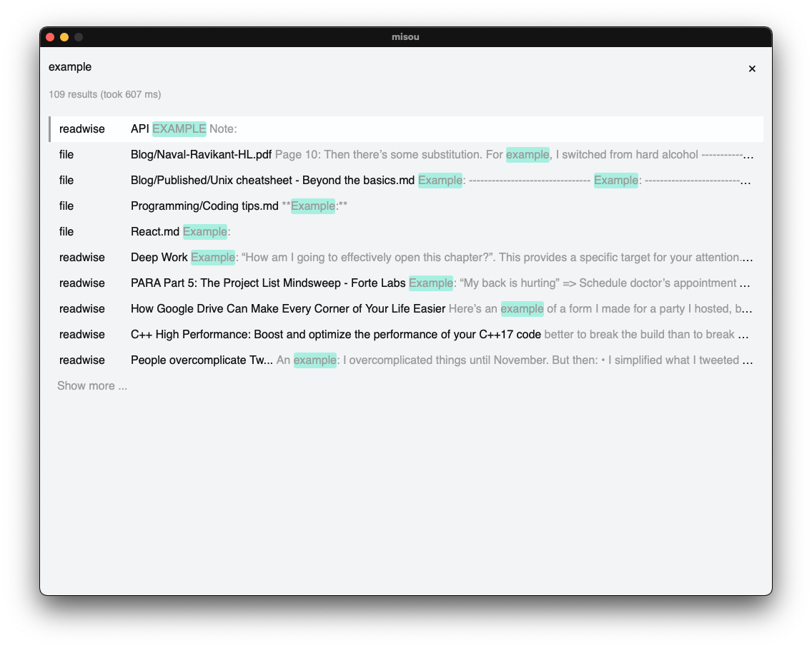

# 🔎 Mi 搜 - a personal search engine



Misou is a personal search engine very much inspired by [monocle](https://github.com/thesephist/monocle) that looks through my knowledge sources. It is written in Go and React and uses [wails](https://wails.app/) to build a native desktop app. The app is mainly build for my usage but I tried to make it generally usable. It's usable at this point but still early-stage.

## Features

- search and configure different [sources](#sources)
- file links are opened in Obsidian
- browser links are opened in Browser
- shortcuts

## Installation

Words of caution: The installation is suited to my setup and has not been tested on other machines. If you encounter problems, please contact me :)

0.  Install the dependencies:

    ```
    brew install ripgrep-all jq
    ```

1.  Create `appconfig.json` and fill fields that apply:

    ```json
    {
      "repoPath": "",
      "readwiseCsvPath": "",
      "instapaperPath": "",
      "peoplePath": "",
      "peopleUrl": "",
      "twitterPath": "",
      "fileScrapeRgaPath": "/Users/name/homebrew/bin/rga",
      "fileScrapePath": "",
      "secretsSubPath": "/secrets",
      "historyBashSubPath": "/source/history.sh",
      "bookmarkBashSubPath": "/source/bookmarks.sh",
      "sources": {
        "bookmarks": true,
        "history": true,
        "localfiles": true,
        "gdrive": false,
        "instapaper": true,
        "readwise": true,
        "people": false,
        "twitter": true
      }
    }
    ```

    `gdrive` and `people` are not supported by me :)

2.  Move `appconfig.json` to desired directory
3.  Export config path:
    ```
    export misouCfg=/Users/adria/Programming/misou/appconfig.json
    ```
4.  Build app:
    ```
    make build
    ```
    Note that the config location is injected during build time and cannot be changed afterwards!
5.  Generate search index (if local sources are used, see [Sources](#sources))

    ```
    make index
    ```

### Development

Use `make dev` to build the backend and exposes it through a websocket and `make dev-front` for the development frontend server.
Note that for `make dev` it is necessary to set `cfgPath` inside the source file `integration.go`, since it is not possible to inject the path as in `build`!

## Sources

using external API (slow ~500ms):

- local file folder
- bookmarks and history (tested with Chrome)

locally indexed (much faster ~30ms):

- readwise (provided with exported csv)
- instapaper
- twitter
- personal CRM (not public but based on [noahm's fork of mira](https://github.com/noahm/contactful))

---

The data of indexed sources need to be manually updated in the folder. Afterwards, the index can be rebuilt using `make index`

### Readwise

If you use Obsidian, it's better to use the Readwise-sync plugin and combine it with local file search.
Otherwise export the csv manually from the UI.

### Instapaper

If you use Readwise, highlights are synced, but this plugin allows for full-text search in archive by locally downloading the file content.

### Twitter

To get the twitter archive check [here](https://help.twitter.com/en/managing-your-account/how-to-download-your-twitter-archive).
The update of the twitter archive requires a conversion of the `tweet.js` to a json file. [This](https://www.convertonline.io/convert/js-to-json) converter can be used, saving the file in `tweet.json` to format the file in vscode. The latter ensures proper escaping of `"` in field text.

## Future features

- support exact search (indicated with surrounding `"`) not only for indexed sources
- integrate Memex
- Alfred workflow

## Bugs

I use `fzf` and the [bookmarks](https://github.com/junegunn/fzf/wiki/examples#bookmarks) and [history](https://github.com/junegunn/fzf/wiki/examples#bookmarks) function and found that after a system restart, I need to run these commands once before running my scripts for the corresponding sources.

In `sources`, there is a Gdrive client which I don't support anymore because I don't need it. I remember that after a few days the token had to be deleted manually.

## Dependencies

- [wails](https://wails.app/): for native app build
- [RGA](https://github.com/phiresky/ripgrep-all): for local file search
- [Blevesearch](https://github.com/blevesearch/bleve): used as main indexer (alternative implementation based on [Apollo](https://github.com/amirgamil/apollo#design) can also be used)

## Attributions

Appicon (Sou): <a href="https://www.freepik.com" title="Freepik">Freepik</a> from <a href="https://www.flaticon.com/" title="Flaticon">www.flaticon.com</a>

This project started on a [hackathon](https://devpost.com/software/gerstler) with the help of my friends from university.
